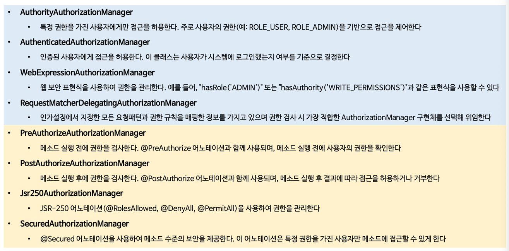
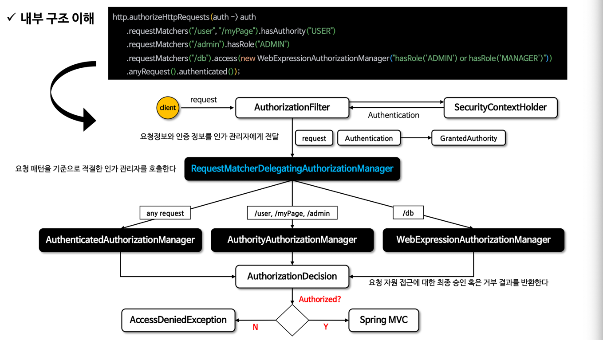
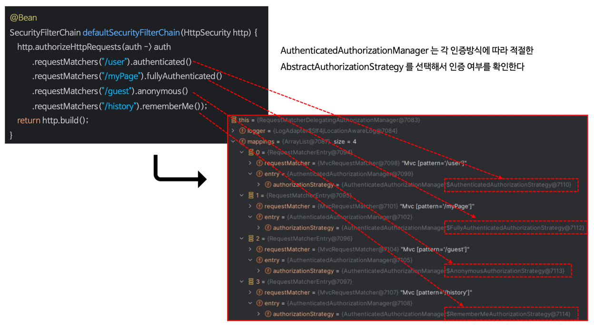
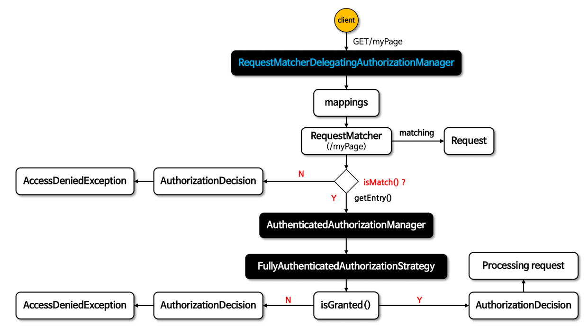
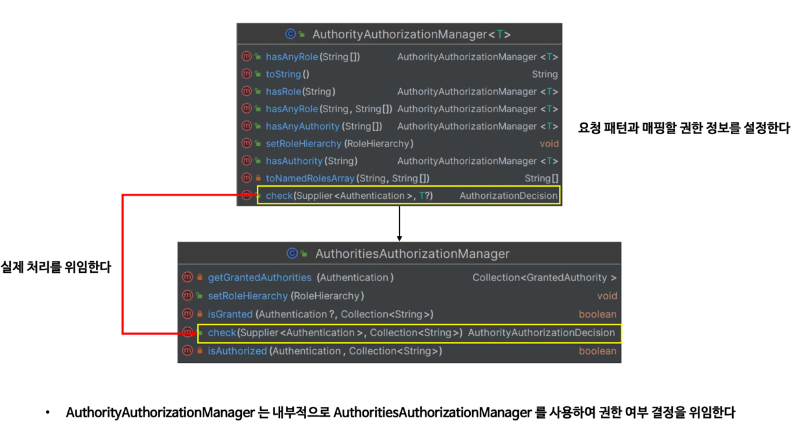
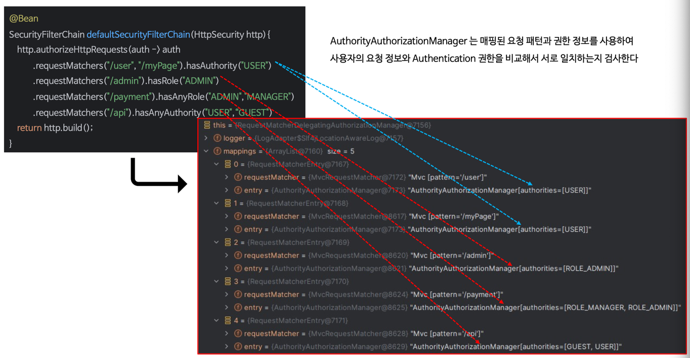
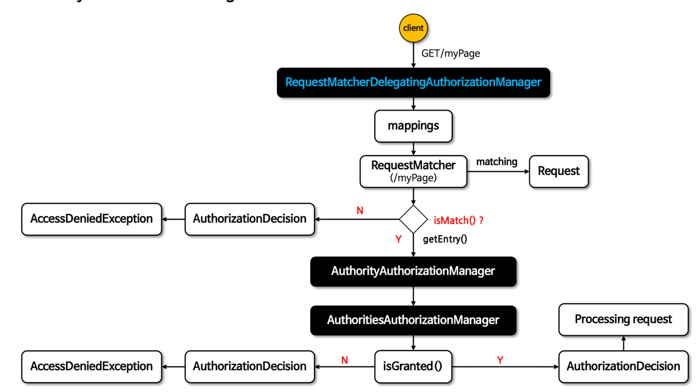
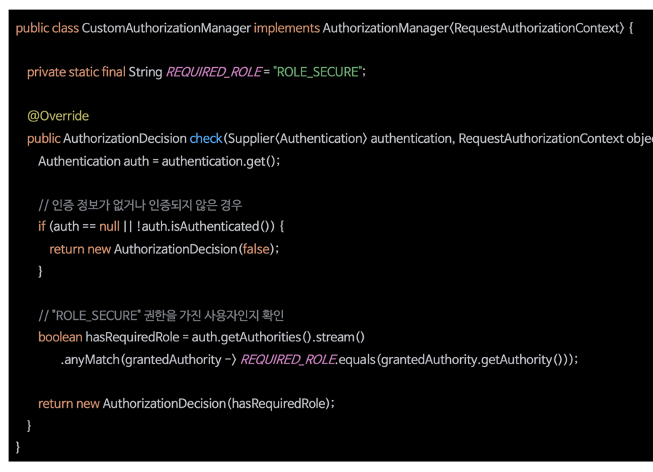

# Authorization
- 인가 : 특정 자원에 접근할 수 있는 사람을 결정하는 것
- Spring Security 인가 관리
  - GrantedAuthority 클래스를 통해 권한 목록을 관리하고 있음
  - Authentication 객체와 연결

## GrantedAuthority
- Authentication에 GrantedAuthority 권한 목록을 저장 -> 인증 주체에게 부여된 권한 사용
- AuthenticationManager에 의해 Authentication 객체에 삽입됨
- 인가 결정을 내릴 때 AuthorizationManager를 사용하여 Authentication 내부 GrantedAuthority 객체를 읽어 처리함

## 사용자 정의 역할 접두사
- 역할 기반의 인가 규칙은 역할 앞에 ROLE_를 접두사로 사용
- "USER" 역할을 가진 보안 컨텍스트가 필요한 인가 규칙이 있다면
  - Spring Security는 기본적으로 "ROLE_USER"를 반환하는 GrantedAuthority#getAuthority를 찾음
- 사용자 지정 가능
  - GrantedAuthorityDefaults
  - 역할 기반 인가 규칙에 사용할 접두사를 사용자 정의하는데 사용

# AuthorizationManger
- 인증된 사용자가 해당 자원에 접근할 수 있는지 여부를 결정하는 인터페이스
- 인증된 사용자의 권한 정보 + 요청 자원의 보안 요구 사항 -> 권한 부여 결정
- 요청 기반, 메소드 기반 -> AuthorizationManager 호출됨 -> 최종 액세스 제어 결정 수행
- 권한 부여 처리 -> AuthorizationFilter
  - AuthorizationFilter -> AuthorizationManager 호출 -> 권한 부여 결정

## 인터페이스 구조
- check()
  - 권한 부여 결정을 내릴 때 필요한 정보 전달
  - 액세스
    - 허용 : true를 포함하는 AuthorizationDecision 반환
    - 거부 : false를 포함하는 AuthorizationDecision 반환
    - 결정할 수 없음 : null 반환
- verify()
  - check() 호출
    - false값을 가진 AuthorizationDecision인 경우
    - throw AccessDeniedException

## 구현체
- 요청 기반 권한 부여 관리자
  - RequestMatcherDelegatingAuthorizationManager
    - AuthenticatedAuthorizationManager
    - AuthorityAuthorizationManger
    - WebExpressionAuthorizationManager

- 메서드 기반 권한 부여 관리자
  - PreAuthorizeAuthorizationManger
  - PostAuthorizeAuthorizationManager
  - Jsr250AuthorizationManager
  - SecuredAuthorizationManager


# 요청 기반 인가 관리자
- 요청 기반의 인증된 사용자 및 특정 권한을 가진 사용자의 자원 접근 허용 여부를 결정하는 인가 관리자 클래스 제공
- AuthorityAuthorizationManager, AuthenticatedAuthorizationManager, RequestMatcherDelegatingAuthorizationManager

## 스프링 시큐리티 인가 처리
```java
http.authorizeHttpResponse(auth) -> auth
        .requestMatchers("/user").hasRole("USER")
```
- /user 엔드포인트 접근은 인증 객체에서 ROLE_USER 권한이 필요하다.

## 내부 구조

1. Client Request -> Spring Security 필터 체인 진입
2. AuthorizationFilter가 요청 정보와 인증 객체(Authentication)를 SecurityContextHolder에서 가져옴
3. RequestMatcherDelegatingAuthorizationManager에게 요청 위임
4. 요청 경로 패턴에 따라 어떤 AuthorizationManager를 쓸지 결정
5. AuthorizationManager는 AuthorizationDecision 객체를 반환 
6. AuthorizationDecision#isGranted() -> true면 통과, false면 AccessDeniedException 발생


## AuthenticatedAuthorizationManager
### 구조
- AuthenticatedAuthorizationManager()
  - FullyAuthenticatedAuthorizationStrategy : 익명 인증 및 기억하기 인증이 아닌지 검사
  - RememberMeAuthorizationStrategy : 기억하기 인증인지 검사
  - AuthenticatedAuthorizationStrategy : 인증된 사용자인지 검사
  - AnonymousAuthorizationStrategy : 익명 사용자인지 검사
- 내부적으로 네 개의 AbstractAuthorizationStrategy 구현을 통해 인증 여부 확인 전략을 세움


### 흐름도

1. Client 요청
2. RequestMatcherDelegatingAuthorizationManager
   - Spring Security에서 해당 매니저에서 요청 경로와 등록된 매핑 정보를 비교
   - 어떤 AuthorizationManager가 이 요청을 처리할지 결정
     - mappings 리스트를 순회하며 각 RequestMatcher와 요청이 isMatch() 되는지 검사
     - 일치할 경우 getEntry()를 통해 대응되는 AuthorizationManager를 반환
3. AuthenticatedAuthorizationManager
   - 오직 사용자가 인증되었는지만 확인 (권한 고려 x)
4. FullyAuthenticatedAuthorizationStrategy
   - 인증 상태를 세가지로 나눠 확인
     - 익명 -> 거부
     - Remember-Me 인증 -> 거부
     - 완전 인증 -> 허용
   - 검사 메서드
     - isGranted() -> boolean
       - 인증된 사용자 -> true -> 요청 처리 진행
       - 인증되지 않은 사용자 -> false
5. AuthorizationDecision
   - true -> Spring MVC로 요청 전달
   - false -> AccessDeniedException 발생 -> 403 응답 변환

## AuthorityAuthorizationManager
### 구조
- AuthorityAuthorizationManager는 내부적으로 AuthoritiesAuthorizationManager를 사용하여 권한 여부 결정을 위임


### 매핑
- 매핑된 요청 패턴과 권한 정보를 사용하여 사용자의 요청 정보와 Authentication 권한을 비교해서 서로 일치하는지 검사


### 흐름

1. 클라이언트 요청
2. RequestMatcherDelegatingAuthorizationManager 동작
   - 등록된 mappings 중에서 요청 경로와 일치하는지 RequestMatcher로 검사
     - isMatch() == true면 해당 엔트리의 AuthorizationManager를 꺼냄 (getEntry())
3. AuthorityAuthorizationManager 처리
   - 내부적으로 AuthoritiesAuthorizationManager 사용
   - Authentication 객체의 getAuthorities() 값을 검사
4. AuthoritiesAuthorizationManager.isGranted()
   - isGranted() == true : 요청 허용 -> Spring MVC로 전달
   - isGranted() == false : AuthorizationDecision(false) -> AccessDeniedException 발생

# 요청 기반 Custom_AuthorizationManager 구현
- 인가 설정 시 선언적 방식이 아닌 프로그래밍 방식으로 구현 가능

## access()
- access(AuthorizationManager) API 사용
- access()에는 AuthorizationManager<RequestAuthorizationContext> 타입의 객체를 전달할 수 있음
- 사용자 요청에 대한 권한 검사를 access()에 지정한 AuthorizationManager가 처리
- access()에 지정한 AuthorizationManager 객체는 RequestMatcherDelegatingAuthorizationManager의 매핑 속성에 저장됨
```java
http.authorizeHttpRequest(auth ->
        auth.requestMatcher().access(AuthorizationManager)
)
```


## 적용
- 특정 엔드포인트에 대한 권한 검사를 수행하기 위해 AuthorizationManager를 구현하여 설정 
- "/user", "/myPage", "/admin" 요청 패턴의 검사는 AuthorityAuthorizationManager가 처리
- "/api" 요청 패턴의 권한 검사는 CustomAuthorizationManager가 처리
```java
http.authorizeHttpRequest(auth -> auth 
        .requestMatchers("/user", "/myPage").hasAuthority("USER")
        .requestMatchers("/admin").hasRole("ADMIN")
        .requestMatchers("/api").access(new CustomAuthorizationManager()));
```

## 예시


# RequestMatcherDelegatingAuthorizationManager 인가 설정 응용하기
- RequestMatcherAuthorizationManager의 mappings 속성에 직접 RequestMatcherEntry 객체를 생성하고 추가

## 적용
- RequestMatcherDelegatingAuthorizationManager를 감싸는 CustomRequestMatcherDelegatingAuthorizationManager를 구현
```java
http.authorizeHttpRequests(auth -> auth
        .anyRequest().access(new CustomRequestMatcherDelegatingAuthorizationManageR())
)
```


## CustomRequestDelegatingAuthorizationManager
- 요청에 대한 권한 검사를 RequestMatcherDelegatingAuthorizationManager 객체가 수행
- RequestMatcherDelegatingAuthorizationManager > CustomRequestDelegatingAuthorizationManager > RequestMatcherDelegatingAuthorizationManager 구조
