# Authorization
- 인가 : 특정 자원에 접근할 수 있는 사람을 결정하는 것
- Spring Security 인가 관리
  - GrantedAuthority 클래스를 통해 권한 목록을 관리하고 있음
  - Authentication 객체와 연결

## GrantedAuthority
- Authentication에 GrantedAuthority 권한 목록을 저장 -> 인증 주체에게 부여된 권한 사용
- AuthenticationManager에 의해 Authentication 객체에 삽입됨
- 인가 결정을 내릴 때 AuthorizationManager를 사용하여 Authentication 내부 GrantedAuthority 객체를 읽어 처리함

## 사용자 정의 역할 접두사
- 역할 기반의 인가 규칙은 역할 앞에 ROLE_를 접두사로 사용
- "USER" 역할을 가진 보안 컨텍스트가 필요한 인가 규칙이 있다면
  - Spring Security는 기본적으로 "ROLE_USER"를 반환하는 GrantedAuthority#getAuthority를 찾음
- 사용자 지정 가능
  - GrantedAuthorityDefaults
  - 역할 기반 인가 규칙에 사용할 접두사를 사용자 정의하는데 사용

# AuthorizationManger
- 인증된 사용자가 해당 자원에 접근할 수 있는지 여부를 결정하는 인터페이스
- 인증된 사용자의 권한 정보 + 요청 자원의 보안 요구 사항 -> 권한 부여 결정
- 요청 기반, 메소드 기반 -> AuthorizationManager 호출됨 -> 최종 액세스 제어 결정 수행
- 권한 부여 처리 -> AuthorizationFilter
  - AuthorizationFilter -> AuthorizationManager 호출 -> 권한 부여 결정

## 인터페이스 구조
- check()
  - 권한 부여 결정을 내릴 때 필요한 정보 전달
  - 액세스
    - 허용 : true를 포함하는 AuthorizationDecision 반환
    - 거부 : false를 포함하는 AuthorizationDecision 반환
    - 결정할 수 없음 : null 반환
- verify()
  - check() 호출
    - false값을 가진 AuthorizationDecision인 경우
    - throw AccessDeniedException

## 구현체
- 요청 기반 권한 부여 관리자
  - RequestMatcherDelegatingAuthorizationManager
    - AuthenticatedAuthorizationManager
    - AuthorityAuthorizationManger
    - WebExpressionAuthorizationManager

- 메서드 기반 권한 부여 관리자
  - PreAuthorizeAuthorizationManger
  - PostAuthorizeAuthorizationManager
  - Jsr250AuthorizationManager
  - SecuredAuthorizationManager


# 요청 기반 인가 관리자
- 요청 기반의 인증된 사용자 및 특정 권한을 가진 사용자의 자원 접근 허용 여부를 결정하는 인가 관리자 클래스 제공
- AuthorityAuthorizationManager, AuthenticatedAuthorizationManager, RequestMatcherDelegatingAuthorizationManager

## 스프링 시큐리티 인가 처리
```java
http.authorizeHttpResponse(auth) -> auth
        .requestMatchers("/user").hasRole("USER")
```
- /user 엔드포인트 접근은 인증 객체에서 ROLE_USER 권한이 필요하다.

## 내부 구조

1. Client Request -> Spring Security 필터 체인 진입
2. AuthorizationFilter가 요청 정보와 인증 객체(Authentication)를 SecurityContextHolder에서 가져옴
3. RequestMatcherDelegatingAuthorizationManager에게 요청 위임
4. 요청 경로 패턴에 따라 어떤 AuthorizationManager를 쓸지 결정
5. AuthorizationManager는 AuthorizationDecision 객체를 반환 
6. AuthorizationDecision#isGranted() -> true면 통과, false면 AccessDeniedException 발생


## AuthenticatedAuthorizationManager
### 구조
- AuthenticatedAuthorizationManager()
  - FullyAuthenticatedAuthorizationStrategy : 익명 인증 및 기억하기 인증이 아닌지 검사
  - RememberMeAuthorizationStrategy : 기억하기 인증인지 검사
  - AuthenticatedAuthorizationStrategy : 인증된 사용자인지 검사
  - AnonymousAuthorizationStrategy : 익명 사용자인지 검사
- 내부적으로 네 개의 AbstractAuthorizationStrategy 구현을 통해 인증 여부 확인 전략을 세움


### 흐름도

1. Client 요청
2. RequestMatcherDelegatingAuthorizationManager
   - Spring Security에서 해당 매니저에서 요청 경로와 등록된 매핑 정보를 비교
   - 어떤 AuthorizationManager가 이 요청을 처리할지 결정
     - mappings 리스트를 순회하며 각 RequestMatcher와 요청이 isMatch() 되는지 검사
     - 일치할 경우 getEntry()를 통해 대응되는 AuthorizationManager를 반환
3. AuthenticatedAuthorizationManager
   - 오직 사용자가 인증되었는지만 확인 (권한 고려 x)
4. FullyAuthenticatedAuthorizationStrategy
   - 인증 상태를 세가지로 나눠 확인
     - 익명 -> 거부
     - Remember-Me 인증 -> 거부
     - 완전 인증 -> 허용
   - 검사 메서드
     - isGranted() -> boolean
       - 인증된 사용자 -> true -> 요청 처리 진행
       - 인증되지 않은 사용자 -> false
5. AuthorizationDecision
   - true -> Spring MVC로 요청 전달
   - false -> AccessDeniedException 발생 -> 403 응답 변환

## AuthorityAuthorizationManager
### 구조
- AuthorityAuthorizationManager는 내부적으로 AuthoritiesAuthorizationManager를 사용하여 권한 여부 결정을 위임


### 매핑
- 매핑된 요청 패턴과 권한 정보를 사용하여 사용자의 요청 정보와 Authentication 권한을 비교해서 서로 일치하는지 검사


### 흐름

1. 클라이언트 요청
2. RequestMatcherDelegatingAuthorizationManager 동작
   - 등록된 mappings 중에서 요청 경로와 일치하는지 RequestMatcher로 검사
     - isMatch() == true면 해당 엔트리의 AuthorizationManager를 꺼냄 (getEntry())
3. AuthorityAuthorizationManager 처리
   - 내부적으로 AuthoritiesAuthorizationManager 사용
   - Authentication 객체의 getAuthorities() 값을 검사
4. AuthoritiesAuthorizationManager.isGranted()
   - isGranted() == true : 요청 허용 -> Spring MVC로 전달
   - isGranted() == false : AuthorizationDecision(false) -> AccessDeniedException 발생

# 요청 기반 Custom_AuthorizationManager 구현
- 인가 설정 시 선언적 방식이 아닌 프로그래밍 방식으로 구현 가능

## access()
- access(AuthorizationManager) API 사용
- access()에는 AuthorizationManager<RequestAuthorizationContext> 타입의 객체를 전달할 수 있음
- 사용자 요청에 대한 권한 검사를 access()에 지정한 AuthorizationManager가 처리
- access()에 지정한 AuthorizationManager 객체는 RequestMatcherDelegatingAuthorizationManager의 매핑 속성에 저장됨
```java
http.authorizeHttpRequest(auth ->
        auth.requestMatcher().access(AuthorizationManager)
)
```


## 적용
- 특정 엔드포인트에 대한 권한 검사를 수행하기 위해 AuthorizationManager를 구현하여 설정 
- "/user", "/myPage", "/admin" 요청 패턴의 검사는 AuthorityAuthorizationManager가 처리
- "/api" 요청 패턴의 권한 검사는 CustomAuthorizationManager가 처리
```java
http.authorizeHttpRequest(auth -> auth 
        .requestMatchers("/user", "/myPage").hasAuthority("USER")
        .requestMatchers("/admin").hasRole("ADMIN")
        .requestMatchers("/api").access(new CustomAuthorizationManager()));
```

## 예시


# RequestMatcherDelegatingAuthorizationManager 인가 설정 응용하기
- RequestMatcherAuthorizationManager의 mappings 속성에 직접 RequestMatcherEntry 객체를 생성하고 추가

## 적용
- RequestMatcherDelegatingAuthorizationManager를 감싸는 CustomRequestMatcherDelegatingAuthorizationManager를 구현
```java
http.authorizeHttpRequests(auth -> auth
        .anyRequest().access(new CustomRequestMatcherDelegatingAuthorizationManageR())
)
```


## CustomRequestDelegatingAuthorizationManager
- 요청에 대한 권한 검사를 RequestMatcherDelegatingAuthorizationManager 객체가 수행
- RequestMatcherDelegatingAuthorizationManager > CustomRequestDelegatingAuthorizationManager > RequestMatcherDelegatingAuthorizationManager 구조

# 메서드 기반 인가 관리자
- 메서드 기반의 인증된 사용자 및 특정 권한을 가진 사용자의 접근 허용 여부를 결정하는 인가 관리자 클래스 제공
- PreAuthorizeAuthorizationManager, PostAuthorization, Jsr250AuthorizationManager, SecuredAuthorizationManager가 있음
- 내부적으로 AOP 방식에 의해 초기화 설정이 이루어지며 메서드의 호출을 MethodInterceptor가 가로채서 처리

```java
@PreAuthoirze("hasAuthority('ROLE_USER')")
public List<User> users() {
    System.out.println("users:" + UserRepository.findAll());
}
```

- users() 메서드 호출은 인증 객체에서 ROLE_USER 권한을 필요로 함

## 메서드 권한 부여 초기화 과정
- 스프링 초기화 단계에서 전체 빈을 검사하면서 빈이 가진 메서드 중 보안이 설정된 메서드가 있는지 탐색
- 보안이 설정된 메서드가 있으면 스프링은 그 빈의 프록시 객체를 자동으로 생성
- 보안이 설정된 메소드에는 인가처리 기능을 하는 Advice를 등록
- 스프링은 빈 참조 시 실제 빈이 아닌 프록시 빈 객체를 참조하도록 처리
- 초기화 과정 종료
- 사용자는 프록시 객체를 통해 메서드를 호출, 프록시 객체는 Advice가 등록된 메서드가 있다면 호출하여 작동
- Advice는 메소드 진입 전 인가 처리를 하게 됨
  - 인가 처리가 승인되면 실제 객체의 메소드를 호출하게됨
  - 인가 처리가 거부되면 예외가 발생하고 메소드 진입 실패

## 메서드 인터셉터 구조
- MethodInterceptor를 이용해 메서드 수준에서 접근 제어를 구현할 때 사용되는 여러 인터셉터 구현체
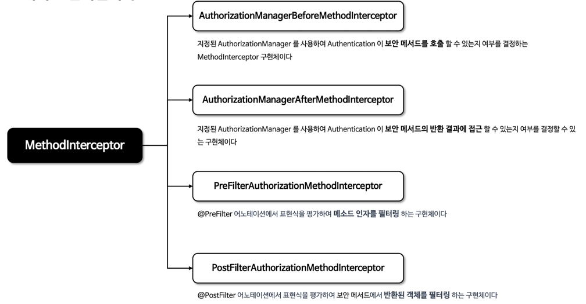

## 초기화 과정 구성도
1. UserService 클래스에 @PreAuthorize, @PostAuthorize 등 보안 어노테이션 선언되어 있음
2. Spring이 시작될 때 InfrastructureAdvisorAutoProxyCreator 동작
3. UserService를 프록시 객체로 감싸면서, 보안 어노테이션에 맞는 Advisor와 MethodInterceptor 연결
4. 메서드 호출 시, 해당 인터셉터들이 개입하여 보안 검사 수행
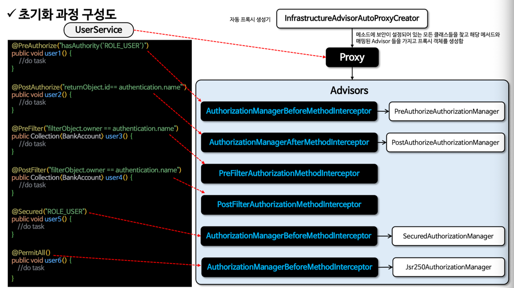

## @PreAuthorize 처리 구조 이해
```java
@PreAuthorize("hasAuthority('ROLE_USER')")
public void users() {}
```
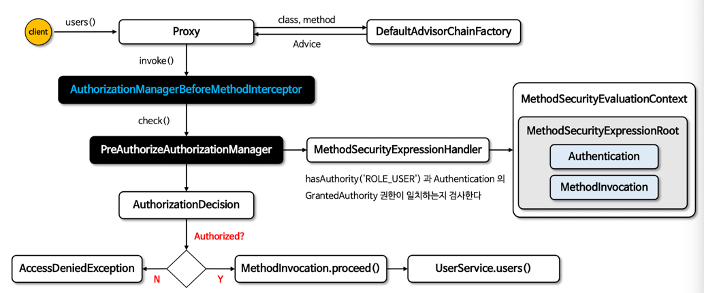

1. 프록시 적용
   - @PreAuthorize가 붙은 메서드는 Spring AOP 프록시로 감싸짐
   - 호출 시 AuthorizationManagerBeforeMethodInterceptor 작동
2. 권한 평가
   - PreAuthorizeAuthorizationManager가 SpEL 표현식을 MethodSecurityExpressionHandler로 전달하여 평가
3. 결정 및 실행
   - 평가 결과 true -> 실제 메서드 실행
   - 평가 결과 false -> AccessDeniedException 발생

## @PostAuthorize 처리 구조 이해
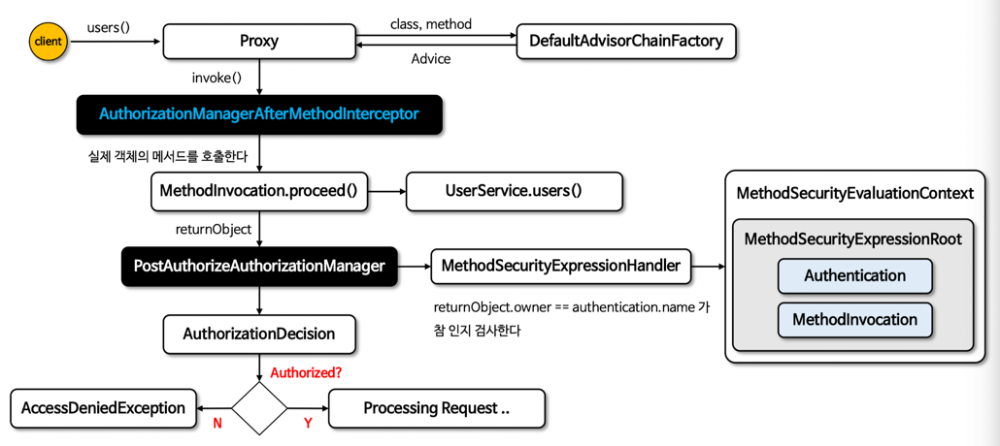
1. 프록시 -> 메서드 실행
   - AOP 프록시가 AuthorizationManagerAfterMethodIntercepter를 거쳐 실제 메서드 실행
2. 리턴값 기반 인가 검사
   - 메서드 반환값을 PostAuthorizeAuthorizationManager가 SpEL로 평가
3. 인가 결과 판단
   - 조건 만족 -> 다음 로직 진행
   - 실패 -> AccessDeniedException

# 메서드 기반 Custom AuthorizationManager 구현
- @PreAuthorize, @PostAuthorize 등의 어노테이션에 대해 내부적으로 제공하는 AuthorizationManager 사용
- 사용자 정의 AuthorizationManager를 직접 등록하여 메서드 보안을 커스텀할 수 있음

## 설정 클래스 정의
- @EnableMethodSecurity(prePostEnabled = false) -> Spring이 기본으로 등록하는 보안 설정을 막음
- AuthorizationManagerBeforeMethodInterceptor와 AuthorizationManagerAfterMethodInterceptor를 직접 등록하여 사용자 정의 로직으로 대체
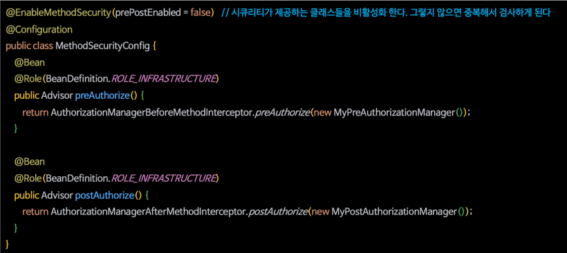

## 사용자 정의 AuthorizationManager 구현
- 단순히 인증되었는지만 판단
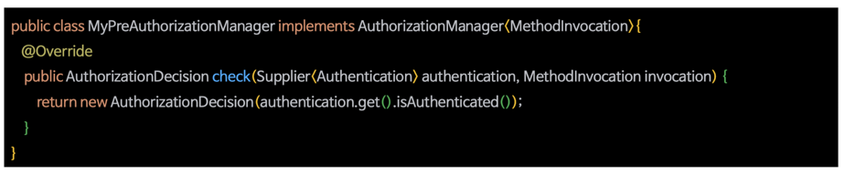

- 메서드 실행 결과(Account 반환값)의 소유자와 현재 사용자 이름을 비교하여 접근 허용 여부 결정
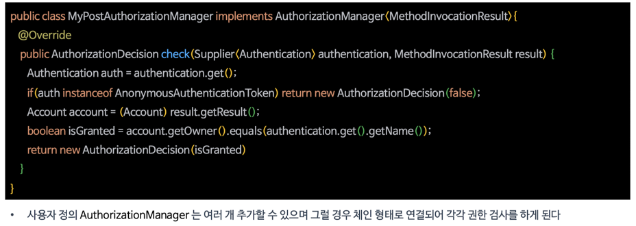

## 인터셉터 순서 지정
- @PostAuthorize가 @Transactional 보다 먼저 실행되면, 보안 검사 실패가 트랜잭션 롤백으로 이어질 수 있음
- @Transactional AOP를 가장 먼저 실행되게 해서, @PostAuthorize나 다른 AOP가 예외를 던져도 트랜잭션이 어떻게 반응할지 개발자가 통제 가능하게 만들 수 있음
- 이를 위해 @EnableTransactionManagement(order = 0)을 통해서 @Transactional 실행 순서를 변경하여 보안 어노테이션보다 먼저 실행하게 설정 
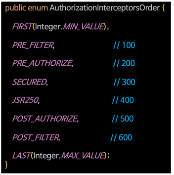
# 포인트 컷 메서드 보안 구현하기
- 메서드 보안은 결국 AOP 기반으로 동작함
- 어노테이션 없이도 포인트컷과 인터셉터를 직접 등록하면 선언적 보안 구현 가능

## 단일 포인트 컷
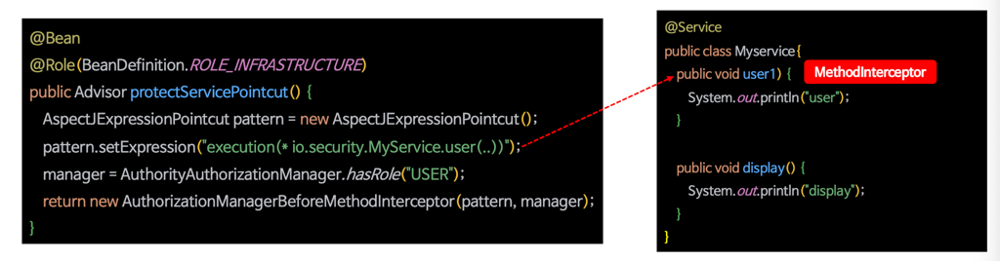
1. AspectJExpressionPointcut 객체
  - 어느 메서드에 적용할 것인지 표현식으로 지정
  - 해당 코드에서는 MyService.user(..)만 매칭
2. AuthorityAuthorizationManager.hasRole("USER")
   - 어떤 권한이 있어야하는지 지정
3. 이걸 AuthorizationManagerBeforeMethodInterceptor에 넘겨
   - 프록시 객체가 해당 메서드 호출 전에 권한을 검사하게 만듦

## 멀티 포인트 컷
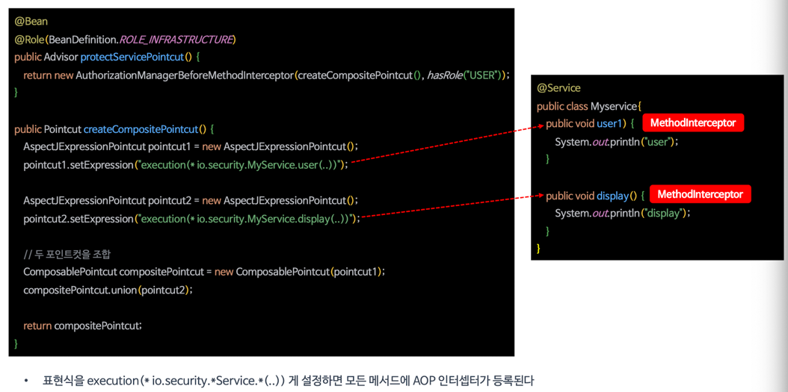
- pointcut1, pointcut2는 각각 user(), display() 메서드에 대한 지정
- 둘을 ComposablePointcut.union()으로 묶어서 여러 메서드에 같은 보안 조건 적용
- 해당 포인트컷을 인터셉터에 넘기면 user(), display() 모두에서 ROLE_USER 권한이 없으면 접근 차단됨

# AOP 메서드 보안 구현하기
- AOP를 이용해 직접 보안 로직을 구성할 수 있음

## AOP 요소 이해
- Advisor
  - 어떤 Advice(=MethodInterceptor)를 언제 어디에 적용할지 결정
- MethodInterceptor (Advice)
  - 실제 대상 메서드 호출 전/후에 실행되는 보안 로직
- Pointcut
  - 어떤 메서드에 인터셉터를 적용할지 결정하는 조건
  - ClassFilter, MethodMatcher를 사용해서 어떤 클래스/메서드에 Advice를 적용할 것인지 결정

## AOP 초기화
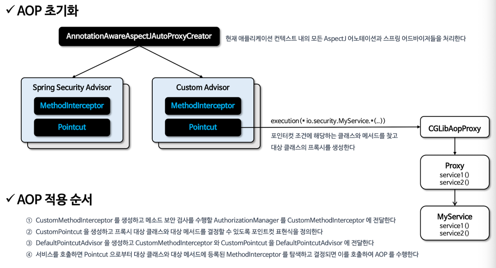
- Spring은 모든 Bean 초기화 과저에서 Advisor를 감지해 AOP 프록시로 감쌈
- execution(* io.security.MyService.*(..)) 같은 표현식에 맞는 메서드에만 프록시 적용

## 구현 예제


