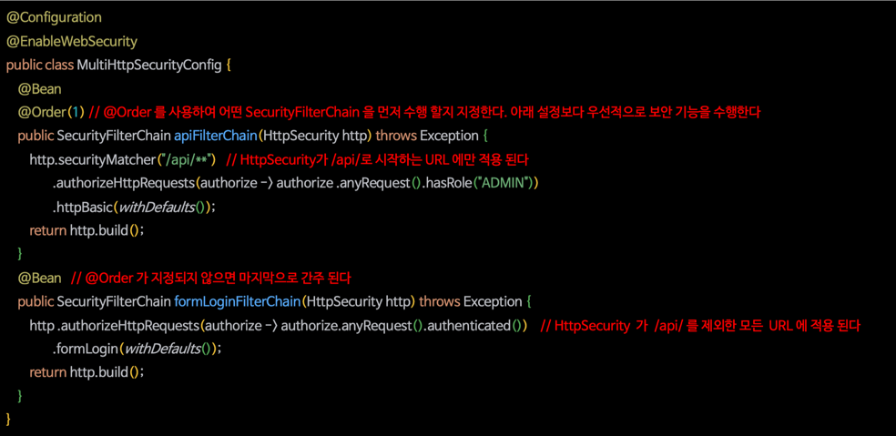
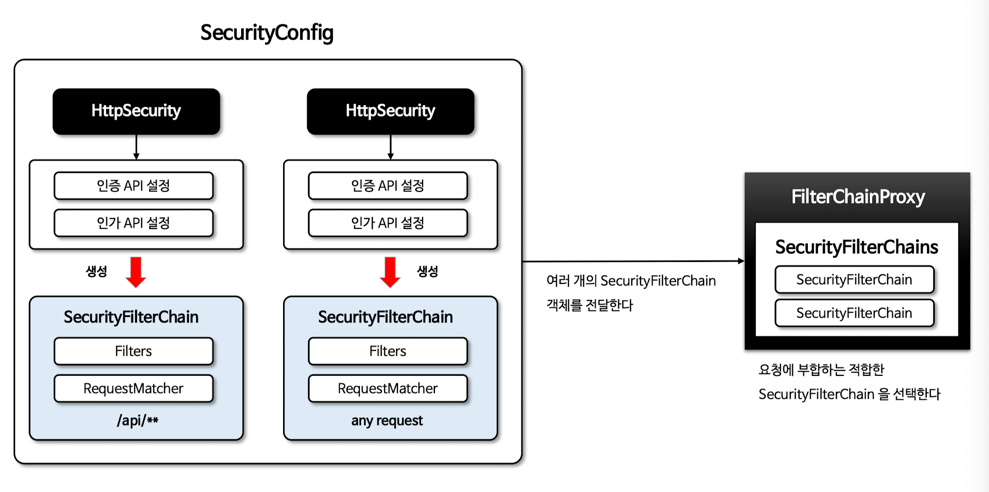
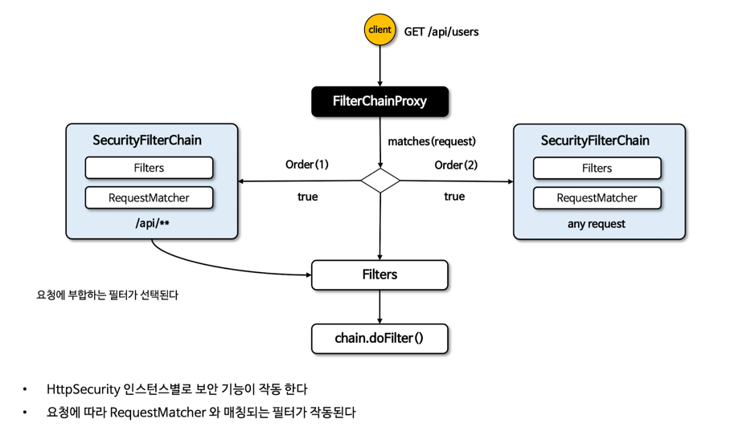
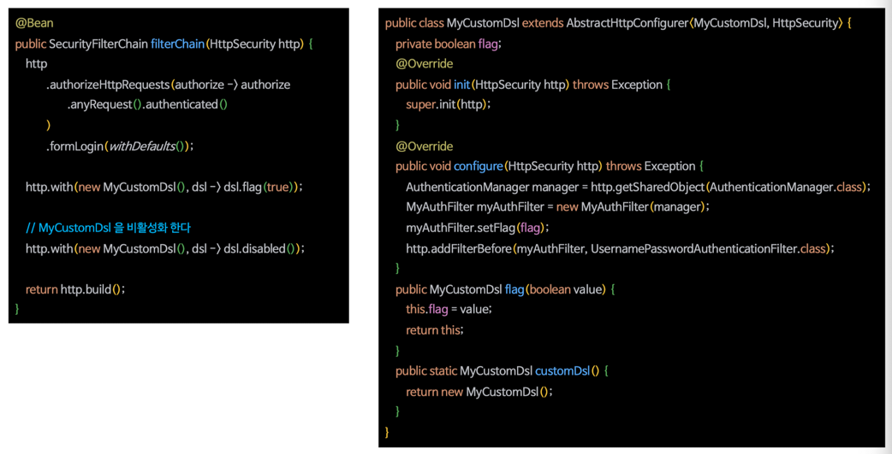

# 다중 보안 설정
- 여러 SecurityFilterChain @Bean을 등록해서 다중 보안 기능 구성 가능

## 다중 보안 설정 초기화 구성
- 여러 개의 SecurityFilterChain 객체를 전달
- 요청에 부합하는 SecurityFilterChain을 선택

## 다중 보안 설정 요청 흐름도

# Custom DSLs
- 사용자 정의 DSL을 구현할 수 있도록 지원
- DSL을 구성하면 필터, 메서드, 속성 등을 한 곳에서 정의하여 처리할 수 있어 편리함

## AbstractHttpConfigurer<AbstractHttpConfigurer, HttpSecurityBuilder>
- 사용자 DSL 구현을 위해 상속받는 추상 클래스
  - init(B builder) - HttpSecurity의 구성요소 설정 및 공유
  - configure(B builder) - 공통클래스를 구성하거나 사용자 정의 필터를 생성하는 작업

## HttpSecurity.with(C configurer, Customizer<C> customizer)
- configurer는 AbstractHttpConfigurer를 상속하고 DSL을 구현한 클래스
- customizer는 DSL 구현 클래스에서 정의한 여러 API를 커스터마이징
- 동일한 클래스를 여러번 설정해도 한번만 적용

## 구현

# 이중화 설정
- 이중화 환경에서 인증, 권한 부여, 세션 관리 등의 보안 기능을 제공
- 사용자 세션을 안전하게 관리하며 이중화된 환경에서 세션 정보를 공유할 수 있는 메커니즘을 제공
  - 레디스 가틍ㄴ 분산 캐시를 사용하여 세션 정보를 여러 서버 간에 공유 가능