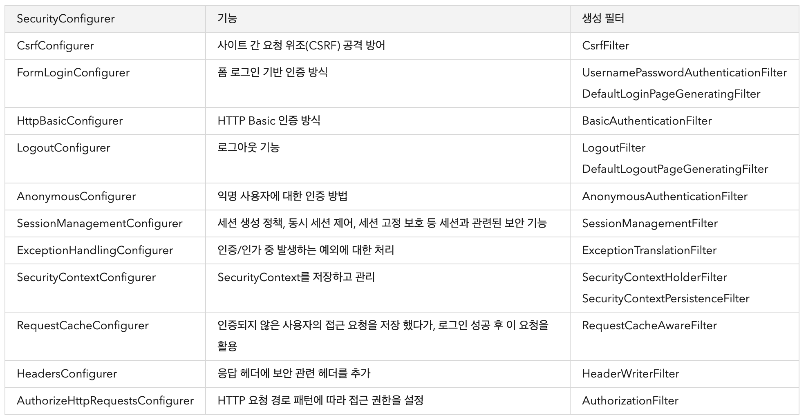
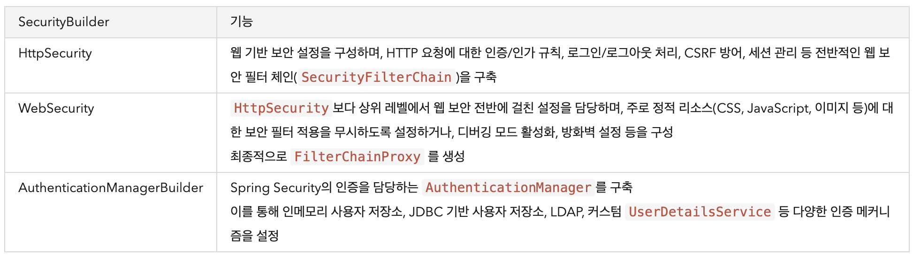
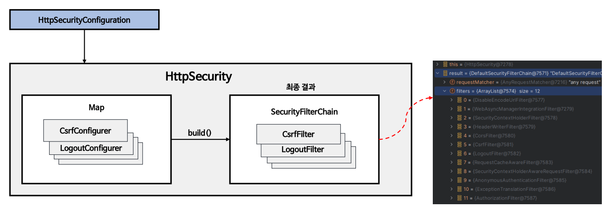
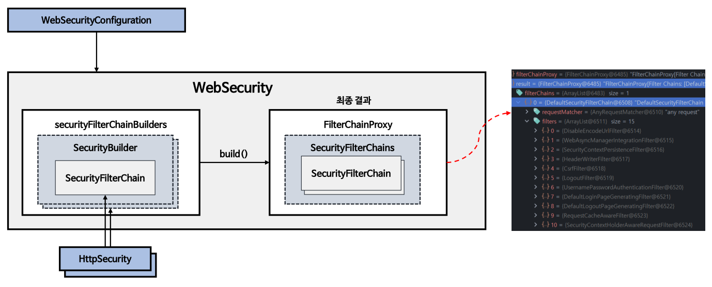
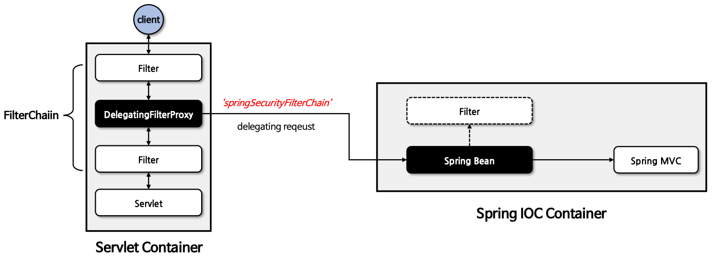
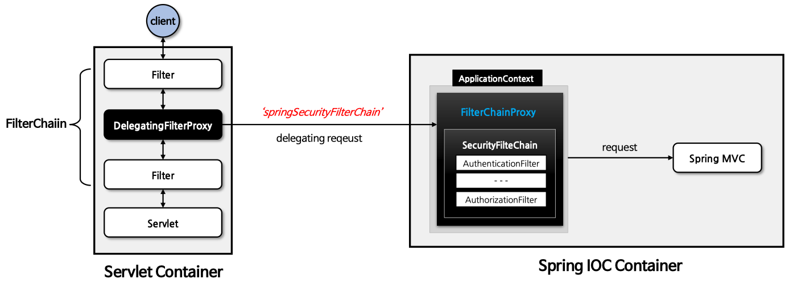
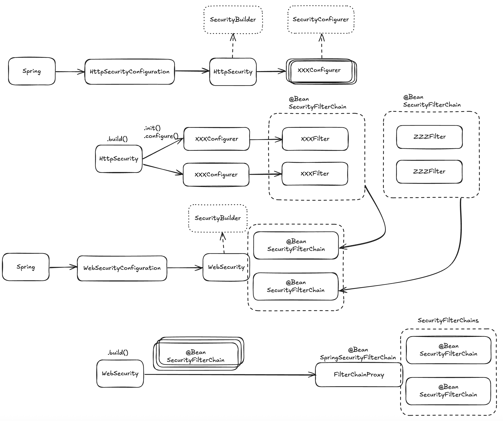
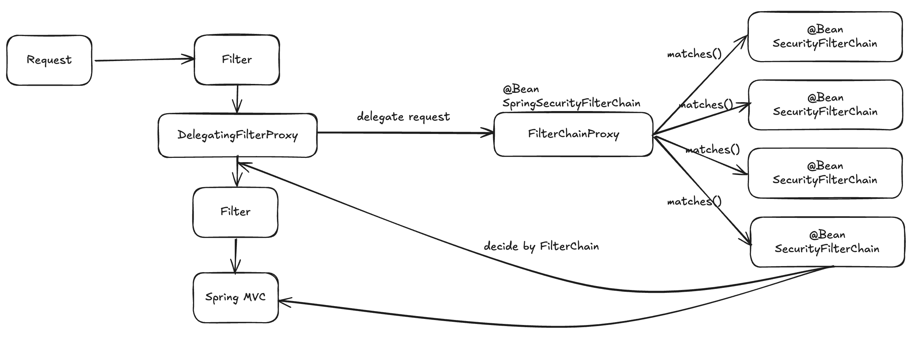

# 초기화 과정 이해
> `Spring Security`가 초기화 될 때 어떤 과정이 이루어 지는지 학습
- 다음과 같은 요소들을 학습
  - SecurityBuilder
  - SecurityConfigurer
  - HttpSecurity
  - WebSecurity
  - DelegatingFilterProxy
  - FilterChainProxy

## 1. SecurityConfigurer
- 보안처리를 담당하는 다양한 `Filter`들을 생성하는데 사용 (인터페이스)
- 구현체로 다음과 같은 것들이 존재

- `SecurityBuilder`에 의해 `init()`, `configure()`가 호출되며 초기화 진행

## 2. SecurityBuilder
- 웹 보안을 구성하는 Bean 객체와 설정 클래스들을 생성
- 구현체로 다음과 같은 것들이 존재

### 1+2. SecurityBuilder & SecurityConfigurer는 어떻게 상호작용 하는가?
1. Spring 애플리케이션 컨텍스트가 초기화 되면서, `SecurityBuilder`의 구현체인 `HttpSecurity`를 생성
2. `HttpSecurity` Bean을 생성하면서, 여러가지 설정 클래스(Configurer)들을 생성
3. `@SpringBootWebSecurityConfiguration`는 `HttpSecurity` 빈의 `.build()`를 호출하고, 최종적으로 `SecurityFilterChain` 빈이 만들어짐
4. `.build()` 내부에서는 설정 클래스(Configurer)들의 `init()`와 `configure()` 메서드를 호출하여 초기화
   - `init()` : 초기 설정, 기본값 설정 등
   - `configure()` : 핵심 설정 로직
5. 최종적으로 각 설정 클래스(Configurer)에 해당되는 `Filter`가 생성 됨

## 3. HttpSecurity
- `HttpSecurityConfiguration`에 의해 생성되고 초기화
- 보안에 필요한 각 설정 클래스로 필터들을 생성, 최종적으로 `SecurityFilterChain` 빈을 생성

### 참고
  - 다른 보안 규칙이나 필터 체인을 걸기 위해, 보통 `SecurityFilterChain`은 여러개가 존재
  - 하나의 `HttpSecurity`는 하나의 `SecurityFilterChain`을 가지고 있음
  - 따라서 하나의 애플리케이션은 여러개의 `HttpSecurity`를 가질 수 있음
### 동작 순서
1. 클라이언트 요청 인입
2. `Matcher`를 통해 현재 요청이 필터에 매칭되는지 확인
   - 매칭되면 필터 수행
   - 매칭 되지 않으면 다음 체인으로 넘어감
3. 모든 필터체인을 넘어가면 요청을 `Servlet`으로 전달

## 4. WebSecurity
- `WebSecurityConfiguration`에 의해 생성되고 초기화
- `HttpSecurity`가 생성한 `SecurityFilterChain` 빈을 `SecurityBuilder`에 저장 -> `.build()`가 실행되면 `SecurityBuilder`에서 `SecurityFilterChain`을 꺼내서 `FilterChainProxy` 생성자에게 전달
  - 최종적으로 `FilterChainProxy`는 여러 `SecurityFilterChain`을 담은 `SecurityFilterChains`를 가지고 있음

## 4. DelegatingFilterProxy
- `Servlet Container`와 `Spring IOC Container`의 연결고리 역할
- `Filter`에서 Spring의 Bean을 사용할 수 있게 해줌
- `Filter` 체이닝 사이에서, `ApplicationContext`내부에 `SpringSecurityFilterChain` 이름으로 생성된 빈을 찾아 요청을 위임
- 무조건 `DelegatingFilterFroxy`를 거쳐야 스프링 시큐리티의 기능을 사용할 수 있음

## 5. FilterChainProxy
- `WebSecurity`에 의해 `SpringSecurityFilterChain`의 이름으로 생성되는 빈
- 내부적으로 여러 `SecurityFilterChain`을 가지고 있고, URL을 기준으로 필터들을 호출
- 마지막 인가처리까지 오류나 예외가 발생하지 않아야 `Servlet`으로 넘어감

## 6. 초기화 큰 그림 정리

1. Spring 애플리케이션이 올라오면서,`HttpSecurityConfiguration`에서 `SecurityBuilder`의 구현체인 `HttpSecurity`를 생성
2. `HttpSecurity`가 생성되며,`SecurityConfigurer`들을 함께 생성
3. `HttpSecurity`의 `.build()`가 호출되면서 초기화 진행
   - `Configurer`들의 `init()`, `configure()` 메서드가 호출되며 `Configurer`들이 초기화 되고, 여기서 각 `Filter`들이 생성 됨 
   - 위 과정에서 `SecurityFilterChain` 빈이 만들어짐
4. Spring 애플리케이션이 올라오면서, `WebSecurityConfiguration`에서 `SecurityBuilder`의 구현체인 `WebSecurity`도 생성 됨
5. `WebSecurity`가 생성되며, `HttpSecurity`에서 생성한 `SecurityFilterChain` 빈을 내부의 `SecurityBuilder`에 저장
6. `WebSecurity`의 `.build()`가 호출되면서 초기화 진행
   - `SecurityFilterChain`을 꺼내 `FilterChainProxy(SpringSecurityFilterChain)`의 생성자로 전달, `SecurityFilterChains`에 여러가지 체인들을 가지고 있게 됨

1. 고객의 요청이 들어옴
2. 필터들을 체이닝하다가, `DelegatingFilterProxy` 필터를 만남
3. `DelegatingFilterProxy`는 `SpringSecurityFilterChain` 빈을 Spring의 `ApplicationContext`에서 찾음
4. 그리고 고객의 요청을 찾은 `SpringSecurityFilterChain`으로 위임
5. `SpringSecurityFilterChain`의 빈인 `FilterChainProxy`는 내부의 가지고 있는 여러개의 `SecurityFilterChain`들의 `matches`를 호출하면서 필터를 체이닝하며 수행
6. 마지막까지 필터 체이닝이 끝나면, 요청은 서블릿으로 넘어감
