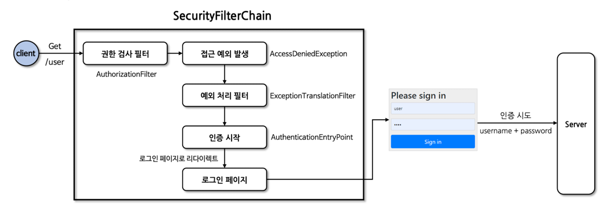
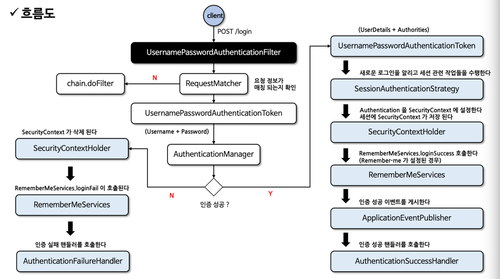
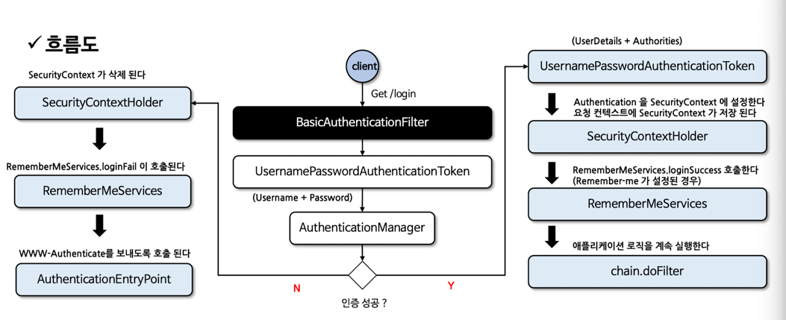

# 섹션 3. 인증 프로세스

## 폼 인증 - formLogin()
- HTTP 기반 폼 로그인 메커니즘 활성화 API
- 기본적으로 스프링에서 제공하는 로그인 페이지 제공



### 설정 방법
FormLoginConfigurer 설정 클래스로 설정
```java
@Bean
    public SecurityFilterChain filterChain(HttpSecurity http) throws Exception {
        http
                .formLogin(httpSecurityFormLoginConfigurer -> httpSecurityFormLoginConfigurer
                        // 사용자 정의 로그인 페이지로 전환
                        .loginPage("/loginPage")
                        // 사용자 이름과 비밀번호 검증 URL 지정
                        .loginProcessingUrl("/loginProcessingUrl")
                        // 로그인 성공 후 이동 페이지
                        // alwaysUse 필드가 true이면 무조건 지정된 위치로 이동, 기본은 false
                        // 인증 전에 보안이 필요한 페이지 방문하다 인증에 성공하면 이전 위치로 리다이렉트
                        .defaultSuccessUrl("/successUrl", true)
                        // 인증에 실패할 경우 사용자에게 보내질 URL 지정
                        .failureUrl("/failureUrl")
                        // 사용자 이름을 받는 폼의 name 지정
                        .usernameParameter("username")
                        // 비밀번호를 받는 폼의 name 지정
                        .passwordParameter("password")
                        // 인증 실패 시 사용할 핸들러 지정
                        .failureHandler(AuthenticationFailureHandler)
                        // 인증 성공 시 사용할 핸들러 지정
                        .successHandler(AuthenticationSuccessHandler)
                        // failureUrl(), loginPage(), loginProcessingUrl()에 대한 URL에 모든 사용자 접근 허용
                        .permitAll()
                );
        return http.build();
    }
```

### 폼 인증 처리 필터
- UsernamePasswordAuthenticationFilter 생성되어 폼 방식 인증 처리 담당
- 인증 프로세스가 초기화 될 때 로그인 페이지와 로그아웃 페이지 생성을 위한 필터가 초기화됨


## 폼 인증 필터 - UsernamePasswordAuthenticationFilter
- AbstractAuthenticationProcessingFilter를 확장
- HttpServletRequest에서 제출된 사용자 이름과 비밀번호로 인증 수행

### 기본 작동 조건
```java
private static final AntPathRequestMatcher DEFAULT_ANT_PATH_REQUEST_MATCHER = new AntPathRequestMatcher("/login",
			"POST");

public UsernamePasswordAuthenticationFilter() {
    super(DEFAULT_ANT_PATH_REQUEST_MATCHER);
}
```

### 코드
```java
@Override
	public Authentication attemptAuthentication(HttpServletRequest request, HttpServletResponse response)
			throws AuthenticationException {
		if (this.postOnly && !request.getMethod().equals("POST")) {
			throw new AuthenticationServiceException("Authentication method not supported: " + request.getMethod());
		}
		String username = obtainUsername(request);
		username = (username != null) ? username.trim() : "";
		String password = obtainPassword(request);
		password = (password != null) ? password : "";
		UsernamePasswordAuthenticationToken authRequest = UsernamePasswordAuthenticationToken.unauthenticated(username,
				password);
		// Allow subclasses to set the "details" property
		setDetails(request, authRequest);
		return this.getAuthenticationManager().authenticate(authRequest);
	}
```

### 흐름


## 기본 인증 - HTTP Basic 인증
RFC 7235 표준, 인증 프로토콜은 HTTP 인증 헤더에 기술됨

### 흐름
1. 클라이언트는 인증정보 없이 서버에 접속 시도
2. 서버가 클라이언트에 401 Unauthorized 응답, WWW-Authenticate 헤더를 기술해서 realm(기술영역)과 Basic 인증 방법 보냄
3. 클라이언트가 서버로 접속할 때 Base64로 password를 인코딩하고 Authorization 헤더에 담아서 요청
4. 성공적으로 완료되면 정상적인 상태 코드를 반환

### Base64
- 데이터를 ASCII 문자로 인코딩하기 위한 방법
- 3바이트(24비트)를 6비트씩 나누어 4개의 10진수로 변환한 후 Base64 문자 테이블에서 4개의 대응 문자로 변환
- 바이너리나 특수문자 등으로 인한 문제 없이 데이터를 표현할 수 있음
- 암호화가 아님. 민감한 정보는 담으면 안됨

### httpBasic() API
- HttpBasicConfigurer 설정 클래스를 통해 여러 API 설정 가능
- BasicAuthenticationFilter가 생성됨

```java
@Bean
    public SecurityFilterChain filterChain(HttpSecurity http) throws Exception {
        http
                .httpBasic(httpSecurityHttpBasicConfigurer -> httpSecurityHttpBasicConfigurer
                        // HTTP 기본 영역을 설정
                        .realmName("security")
                        // 인증 실패 시 호출되는 AuthenticationEntryPoint
                        // 기본값은 "Realm" 영역, BasicAuthenticationEntryPoint 사용
                        .authenticationEntryPoint(
                                (request, response, authException) -> response.sendError(401)
                        )
                );
        return http.build();
    }
```

### 보안 이슈
- Base64로 인코딩하여 전송하기 때문에 암호화된 통신 프로토콜을 사용해서 전송해야함

## BasicAuthenticationFilter
- 기본 인증 서비스 제공
- BasicAuthenticationConverter를 사용해 요청 헤더 속 Base64 인코딩된 username과 password 추출
- 세션 사용 유무에 따라 처리 로직이 다름
  - 세션 사용 O -> 매 요청마다 인증 과정을 거쳐야함
  - 세션 사용 X -> 매 요청마다 인증 과정을 거치지 않음 



## 기억하기 인증 - rememberMe()
### RememberMe 인증
- 로그인 시 자동으로 인증 정보를 기억하는 기능
- UsernamePasswordAuthentication와 함께 사용
- 인증 성공 여부
  - 인증 성공 -> RememberMeServices.loginSuccess()를 통해 RememberMe 토큰을 생성하고 쿠키로 전달
  - 인증 실패 -> RememberMeServices.loginFail()를 통해 쿠키 삭제
- LogoutFilter와 연계하여 로그아웃 시 쿠키를 지움

### 토큰 생성
- base64(username + ":" + expireTime + ":" + algorithmName + ":" + algorithmHex(username + ":" + expirationTime + ":" + password + ":" + key))

### RememberMeServices 구현체
어디에 저장할지에 따라 나뉜다.
- TokenBasedRememberMeServices
  - 사용자 브라우저에 토큰을 쿠키 형태로 저장
  - 서버는 따로 토큰을 저장하지 않음
  - Stateless
- PersistentTokenBasedRememberMeServices
  - 서버 쪽 DB나 영속 저장소에 토큰 저장
  - Stateful
- 구현체 둘다 UserDetailsService가 필요함

### rememberMe() API
```java
@Bean
    public SecurityFilterChain filterChain(HttpSecurity http) throws Exception {
        http
                .rememberMe(httpSecurityRememberMeConfigurer -> httpSecurityRememberMeConfigurer
                        // 기억하기가 체크 되지 않았을때도 쿠키가 항상 생성되어야하는지 여부
                        .alwaysRemember(true)
                        // 토큰이 유효한 시간(초 단위) 지정
                        .tokenValiditySeconds(3600)
                        // UserDetails 조회 시 사용하는 UserDetailsService 지정
                        .userDetailsService(userDetailsService)
                        // 로그인 시 사용자 기억을 위해 사용되는 HTTP 매개변수
                        // 기본값 : remember-me
                        .rememberMeCookieDomain("remember")
                        // 기억하기 인증을 위한 토큰을 저장하는 쿠키 이름
                        // 기본값 : remember-me
                        .rememberMeParameter("remember")
                        // 기억하기 인증을 위해 생성된 토큰을 식별하는 키
                        .key("security")
                );
        return http.build();
    }
```


