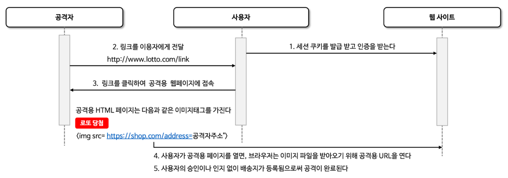
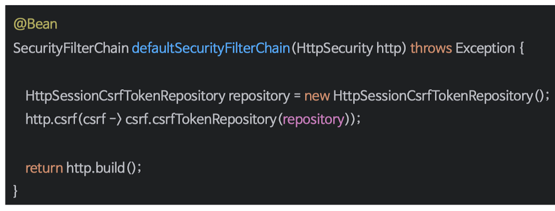
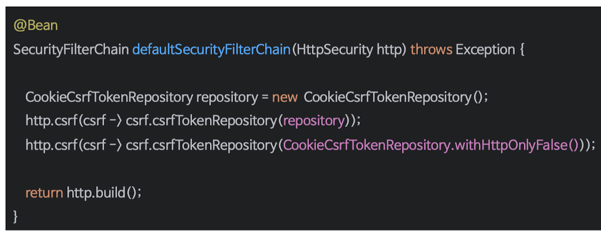
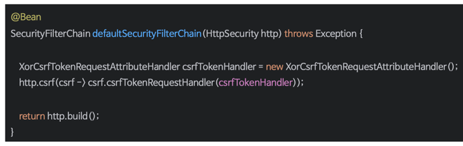
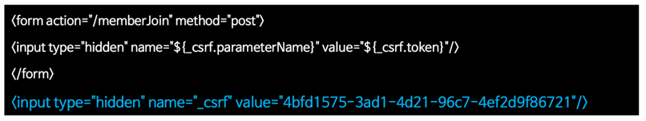
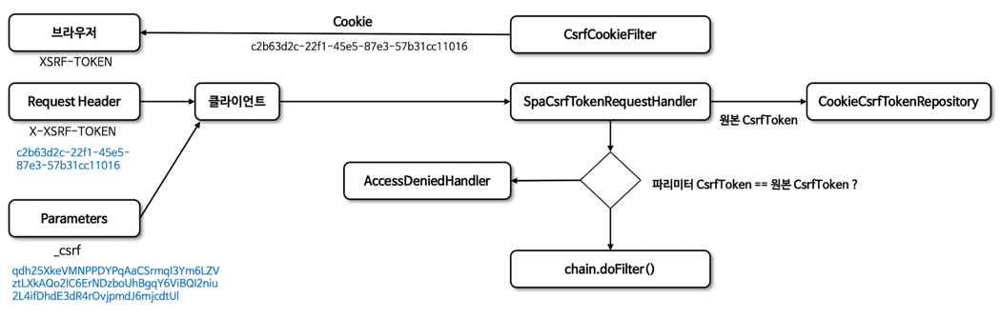

# Same Origin Policy (동일 출처 정책)
- 한 웹 페이지에서 다른 웹 페이지의 데이터를 직접 불러오는 것을 제한하는 정책

# CORS (Cross Origin Resource Sharing)
- 다른 출처의 리소스를 사용할때 사용, 특별한 HTTP 헤더를 통해 한 웹 페이지가 다른 출처의 리소스에 접근할 수 있도록 허가를 구하는 방법
- 웹 애플리케이션이 다른 출처의 데이터를 사용하고자 할 때, 브라우저가 그 요청을 대신해서 해당 데이터를 사용해도 되는 되는지 다른 출처에게 물어보는 것

## 출처
- URL의 구성요소 중 Protocol, Host, Port 세가지가 동일한지 확인

## 종류
1. Simple Request
   - 자동으로 CORS가 작동하여 서버에 본 요청을 한 후, 서버가 응답 헤더에 Access-Control-Allow-Origin 값을 전송하면 브라우저가 서로 비교후 CORS 정책 위반 여부 검사
   - GET, POST, HEAD 중 한가지 메서드 사용
   - 헤더는 Accept, Accept-Language, Content-Language, Content-Type, DPR, Downlink, Save-Data, Viewport-width Width만 가능
   - Content-type은 application/x-www-from-urlencoded, multipart/form-data, text/plain 만 가능
2. Preflight Request
   - 예비 요청과 본 요청으로 나누어 서버에 전달, 브라우저가 예비 요청을 보내는 것을 Preflight라고 함
   - 예비 요청 메소드는 OPTIONS가 사용됨
   - 브라우저 스스로가 안전한 요청인지 확인하는 과정
   - 요청 사양이 Simple Request에 해당하지 않을 경우 브라우저가 Preflight Request를 실행

## cors() & CorsFilter
- CORS의 사전 요청에는 쿠키가 포함되어 있지 않음 -> Spring Security 이전에 처리되어야함
- corsConfigurationSource를 통ㄹ해서 CORS 설정을 할 수 있음
```java
@Configuration
public class CorsConfig {

    @Bean
    public CorsConfigurationSource corsConfigurationSource() {
        CorsConfiguration config = new CorsConfiguration();
        config.setAllowCredentials(true);
        config.setAllowedOrigins(List.of("http://localhost:8080", "http://localhost:3000"));
        config.setAllowedMethods(List.of("GET", "POST", "PUT", "DELETE", "OPTIONS"));
        config.setAllowedHeaders(List.of("*"));

        UrlBasedCorsConfigurationSource source = new UrlBasedCorsConfigurationSource();
        source.registerCorsConfiguration("/**", config);
        return source;
    }
}
```

# CSRF (Cross Site Request Forgery)
- 공격자가 사용자로 하여금 이미 인증된 다른 사이트에 대해 원치 않는 작업을 수행하게 만드는 기법
- 쿠키나 인증 세션을 이용하여 사용자가 의도하지 않은 요청을 서버로 전송하게 만든다.
- 사용자가 로그인한 상태에서 악의적인 웹사이트를 방문하거나 이메일 등을 통해 악의적인 링크를 클릭할 때 발생할 수 있음

## CSRF 진행 순서


## CSRF 기능 활성화

- 토큰은 서버에 의해 생성되고 클라이언트 세션에 저장됨
- 폼을 통해 서버로 전송되는 모든 변경 요청(POST, PUT, DELETE)에 포함되어야함
- CSRF 토큰이 브라우저에 의해 자동으로 포함되지 않는 요청 부분에 위치해야 CSRF 공격 방어가 가능
- 쿠키에 토큰을 요구하는 것은 브라우저가 자동으로 요청에 포함하기 때문에 효과적이지 않음

## CSRF 비활성화


# CSRF 토큰 유지 및 검증
## CSRF 토큰 유지
- CsrfTokenRepository를 통해 영속화
  - HttpSessionCsrfTokenRepository
    - 세션에 토큰 정보 저장
    - HTTP 요청 헤더인 X-CSRF-TOKEN 또는 요청 매개변수인 _csrf에서 토큰을 읽음
    - 
  - CookieCsrfTokenRepository
    - 쿠키에 토큰 정보 저장
    - XSRF-TOKEN 명을 가진 쿠키에 작성
    - HTTP 요청 헤더인 X-XSRF-TOKEN 또는 요청 매개변수인 _csrf에서 읽음
    - JavaScript에서 쿠키를 읽을 수 있도록 HttpOnly를 명시적으로 false로 설정할 수 있음
    - JavaScript로 직접 쿠키를 읽을 필요가 없는 경우 보안을 개선하기 위해 HttpOnly 생략하는게 좋음
    - 

## CSRF 토큰 처리

- CsrfToken은 CsrfTokenRequestHandler를 사용
  - 토큰을 생성 및 응답 토큰 유효성 검증
  - HTTP 헤더 또는 요청 매개변수로부터 토큰의 유효성을 검증하도록 함
- XorCsrfTokenRequestAttributeHandler와 CsrfTokenRequestAttributeHandler를 제공하며 사용자 정의 핸들러 구현 가능

## CSRF 토큰 지연 로딩

- Spring Security는 CsrfToken을 필요할 때까지 로딩을 지연시키는 방법 사용
- CsrfToken은 HttpSession에 저장되어 있기 때문에 매 요청마다 세션으로부터 CsrfToken을 로드할 필요가 없어져 성능 향상 가능
- CsrfToken은 POST와 같은 안전하지 않은 HTTP 메서드를 사용하여 요청이 발생할 때와 CSRF 토큰을 응답에 렌더링하는 모든 요청에서 필요로 하기 때문에 그 외의 요청에는 지연로딩 권장

## CSRF 통합
- 실제 CSRF 토큰을 HTTP 요청에 포함해야함
- 브라우저에 의해 HTTP 요청에 자동으로 포함되지 않는 요청 부분(폼 매개변수, HTTP 헤더 또는 기타 부분) 중 하나에 포함 되어야함
- 다음은 클라이언트 어플리케이션이 CSRF로 보호된 백엔드 애플리케이션과 통합하는 방법에 대한 설명임

### HTML Forms
- HTML 폼을 서버에 제출하려면 CSRF 토큰을 hidden 값으로 Form에 포함해야함


- 폼에 실제 CSRF 토큰을 자동으로 포함하는 뷰
  - Thymeleaf
  - Spring의 폼 태그 라이브러리
### JavaScript Applications
- Single Page Application
  - CookieCsrfTokenRepository.withHttpOnlyFalse를 사용해서 클라이언트가 서버가 발행한 쿠키로 부터 CSRF 토큰을 읽을 수 있도록 함
  - 사용자 정의 CsrfTokenRequestHandler을 만들어 클라이언트가 요청 헤더나 요청 파라미터로 CSRF 토큰을 제출할 경우 이를 검증하도록 구현
  - 클라이언트의 요청에 대해 CSRF 토큰을 쿠키에 렌더링해서 응답할 수 있도록 필터 구현


- Multi Page Application
  - JavaScript가 각 페이지에서 로드되는 멀티 페이지 애플리케이션의 경우 CSRF 토큰을 쿠키에 노출시키는 대신 HTML 메타 태그 내에 CSRF 토큰을 포함시킬 수 있다.


## CsrfFilter

1. Get /login 요청
    - CsrfFilter
      - 요청이 들어오면 CookieCsrfTokenRepository를 통해 기존 CSRF 토큰이 있는지 확인
      - 없다면 새로 생성
    - CookieCsrfTokenRepository
      - 세션에서 CSRF 토큰을 조회하거나, 없으면 새로 생성하여 세션에 저장
      - DeferredCsrfToken 객체 형태로 토큰을 HttpServletRequest에 저장
    - CsrfTokenRequestHandler
      - 이후 요청 중에서 사용될 수 있도록 request에 보관된 토큰을 다시 꺼내 사용
    - ${_csrf.token}
      - HTML 템플릿에서 ${_csrf.token}으로 렌더링하면 이 토큰이 삽입됨
      - form 기반 페이지에서는 <input type="hidden" name="_csrf" value ="..."> 형식으로 포함됨

2. Post /login
   - 클라이언트가 form을 요청할 때 _csrf 필드에 토큰을 포함
   - CsrfFilter
     - form에서 전달된 토큰을 파싱해서 actualToken으로 저장
     - 동시에 세션에 저장된 originalToken을 꺼냄
   - 검증 로직
     - actualToken == originalToken 일 경우 -> 정상 처리
     - actualToken != originalToken 일 경우 -> AccessDeniedHandler가 권한 거부 처리

# SameSite
- 서버가 쿠키를 설정할 때 SameSite 속성을 지정하여 크로스 사이트 간 쿠키 전송에 대한 제어를 핸들링
- 브라우저가 쿠키를 어떤 요청 컨텍스트에서 자동으로 전송할지 여부를 결정하는 정책
- Spring Session에서 SameSite 속성을 지원

## SameSite 속성
- Strict
  - 동일 사이트에서 오는 모든 요청에 쿠키를 포함하고 크로스 사이트간 HTTTP 요청에 쿠키가 포함되지 않는다.
- Lax (기본 설정)
  - 동일 사이트에서 오거나 Top Level Navigation에서 오는 요청 및 메소드가 읽기 전용인 경우 쿠키가 전송되고 그렇지 않으면 HTTP 요청에 쿠키가 포함되지 않는다.
- None
  - 동일한 사이트 및 크로스 사이트 요청에도 쿠키가 전송된다.
  - 반드시 Secure 속성이 필요함

### Top Level Navigation
- 사용자가 브라우저 주소창에 표시되는 URL을 바꾸는 동작을 말함

### Non-Top Level Navigation
- 브라우저 상에서 URL은 그대로 유지되지만, 페이지 내부에서 발생하는 요청

## Spring Session으로 SameSite 적용하기


