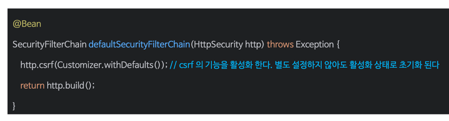
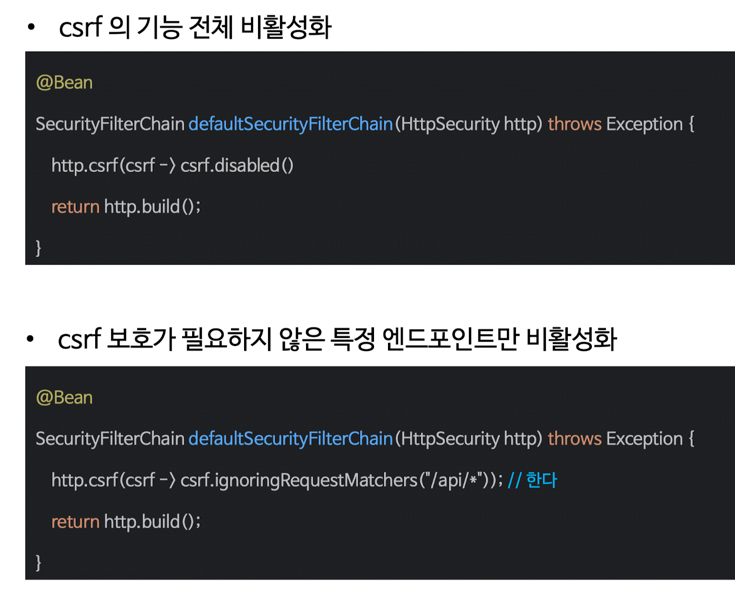
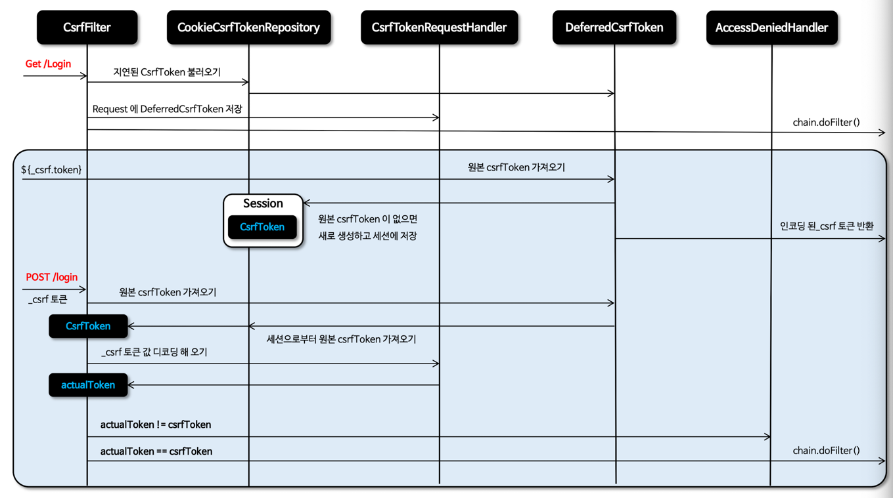
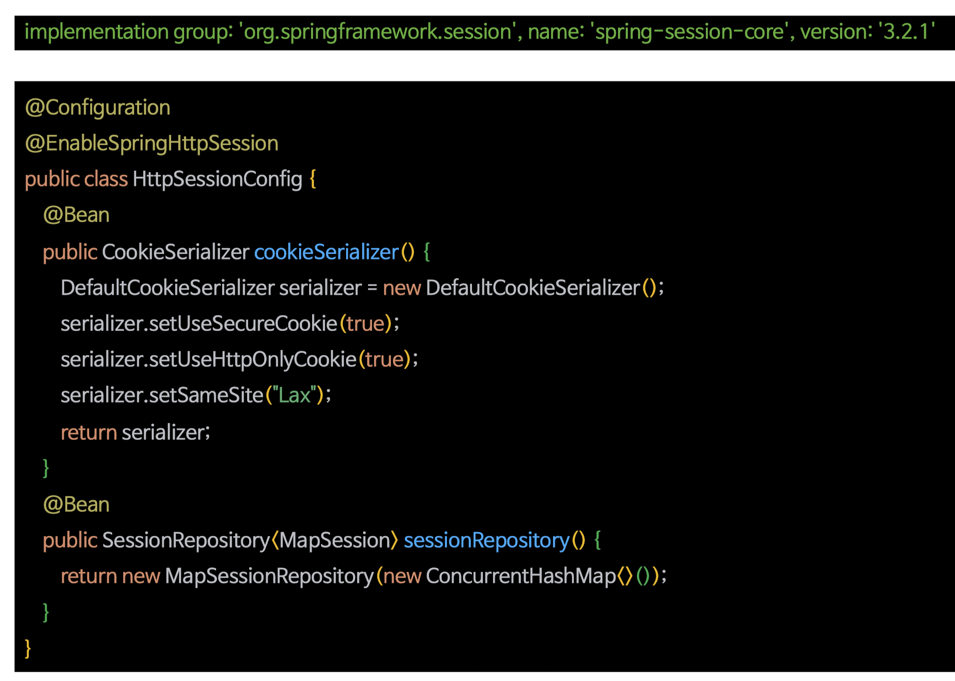

# Same Origin Policy (동일 출처 정책)
- 한 웹 페이지에서 다른 웹 페이지의 데이터를 직접 불러오는 것을 제한하는 정책

# CORS (Cross Origin Resource Sharing)
- 다른 출처의 리소스를 사용할때 사용, 특별한 HTTP 헤더를 통해 한 웹 페이지가 다른 출처의 리소스에 접근할 수 있도록 허가를 구하는 방법
- 웹 애플리케이션이 다른 출처의 데이터를 사용하고자 할 때, 브라우저가 그 요청을 대신해서 해당 데이터를 사용해도 되는 되는지 다른 출처에게 물어보는 것

## 출처
- URL의 구성요소 중 Protocol, Host, Port 세가지가 동일한지 확인

## 종류
1. Simple Request
   - 자동으로 CORS가 작동하여 서버에 본 요청을 한 후, 서버가 응답 헤더에 Access-Control-Allow-Origin 값을 전송하면 브라우저가 서로 비교후 CORS 정책 위반 여부 검사
   - GET, POST, HEAD 중 한가지 메서드 사용
   - 헤더는 Accept, Accept-Language, Content-Language, Content-Type, DPR, Downlink, Save-Data, Viewport-width Width만 가능
   - Content-type은 application/x-www-from-urlencoded, multipart/form-data, text/plain 만 가능
2. Preflight Request
   - 예비 요청과 본 요청으로 나누어 서버에 전달, 브라우저가 예비 요청을 보내는 것을 Preflight라고 함
   - 예비 요청 메소드는 OPTIONS가 사용됨
   - 브라우저 스스로가 안전한 요청인지 확인하는 과정
   - 요청 사양이 Simple Request에 해당하지 않을 경우 브라우저가 Preflight Request를 실행

## cors() & CorsFilter
- CORS의 사전 요청에는 쿠키가 포함되어 있지 않음 -> Spring Security 이전에 처리되어야함
- corsConfigurationSource를 통ㄹ해서 CORS 설정을 할 수 있음
```java
@Configuration
public class CorsConfig {

    @Bean
    public CorsConfigurationSource corsConfigurationSource() {
        CorsConfiguration config = new CorsConfiguration();
        config.setAllowCredentials(true);
        config.setAllowedOrigins(List.of("http://localhost:8080", "http://localhost:3000"));
        config.setAllowedMethods(List.of("GET", "POST", "PUT", "DELETE", "OPTIONS"));
        config.setAllowedHeaders(List.of("*"));

        UrlBasedCorsConfigurationSource source = new UrlBasedCorsConfigurationSource();
        source.registerCorsConfiguration("/**", config);
        return source;
    }
}
```

# CSRF (Cross Site Request Forgery)
- 공격자가 사용자로 하여금 이미 인증된 다른 사이트에 대해 원치 않는 작업을 수행하게 만드는 기법
- 쿠키나 인증 세션을 이용하여 사용자가 의도하지 않은 요청을 서버로 전송하게 만든다.

## CSRF 진행 순서
1. 사용자가 웹사이트 A에 세션 쿠키를 발급 받고 인증을 받는다.
2. 공격자가 사용자에게 링크를 전달한다.
3. 사용자가 링크를 클릭하여 공격용 웹사이트 B에 접속한다.
4. 공격용 웹사이트 B에서 사용자 브라우저를 통해 웹사이트 A로 요청을 전송
5. 브라우저는 기존의 A 사이트 세션 쿠키를 포함해서 요청 전송
6. A 사이트는 정상적인 사용자의 요청인지 구분할 수 없고, 세션이 유효하기 때문에 요청이 처리됨

## CSRF 기능 활성화

- 토큰은 서버에 의해 생성되고 클라이언트 세션에 저장됨
- 폼을 통해 서버로 전송되는 모든 변경 요청(POST, PUT, DELETE)에 포함되어야함
- CSRF 토큰이 브라우저에 의해 자동으로 포함되지 않는 요청 부분에 위치해야 CSRF 공격 방어가 가능
- 쿠키에 토큰을 요구하는 것은 브라우저가 자동으로 요청에 포함하기 때문에 효과적이지 않음

## CSRF 비활성화


# CSRF 토큰 유지 및 검증
## CSRF 토큰 유지
- CsrfTokenRepository를 통해 영속화
  - HttpSessionCsrfTokenRepository
    - 세션에 토큰 정보 저장
    - HTTP 요청 헤더인 X-CSRF-TOKEN 또는 요청 매개변수인 _csrf에서 토큰을 읽음
  - CookieCsrfTokenRepository
    - 쿠키에 토큰 정보 저장
    - XSRF-TOKEN 명을 가진 쿠키에 작성
    - HTTP 요청 헤더인 X-XSRF-TOKEN 또는 요청 매개변수인 _csrf에서 읽음

## CSRF 토큰 처리
- CsrfTokenRequestHandler
  - CsrfToken 생성 및 응답, 토큰 유효성 검증
- 종류
  - XorCsrfTokenRequestAttributeHandler
  - CsrfTokenRequestAttributeHandler

## CSRF 토큰 지연 로딩
- Spring Security는 CsrfToken을 필요할 때까지 로딩을 지연시키는 방법 사용
- CsrfToken은 HttpSession에 저장되어 있기 때문에 매 요청마다 세션으로부터 CsrfToken을 로드할 필요가 없어져 성능 향상 가능

## CSRF 통합
- 실제 CSRF 토큰을 HTTP 요청에 포함해야함
### HTML Forms
- HTML 폼을 서버에 제출하려면 CSRF 토큰을 hidden 값으로 Form에 포함해야함
### JavaScript Applications
- Single Page Application
  - 서버가 XSRF-TOKEN 쿠키로 Token 내려줌 (HttpOnly=false)
  - 클라이언트가 API 호출 시 Header에 Token을 넣어서 전송
  - 서버는 Header 혹은 Parameter -> 원본 Token과 비교 후 검증 처리
- Multi Page Application
  - JavaScript가 각 페이지에서 로드되는 멀티 페이지 애플리케이션의 경우 CSRF 토큰을 쿠키에 노출시키는 대신 HTML 메타 태그 내에 CSRF 토큰을 포함시킬 수 있다.

## CsrfFilter


# SameSite
- 서버가 쿠키를 설정할 때 SameSite 속성을 지정하여 크로스 사이트 간 쿠키 전송에 대한 제어를 핸들링
- 브라우저가 쿠키를 어떤 요청 컨텍스트에서 자동으로 전송할지 여부를 결정하는 정책
- Spring Session에서 SameSite 속성을 지원

## SameSite 속성
- Strict
  - 동일 사이트에서 오는 모든 요청에 쿠키를 포함하고 크로스 사이트간 HTTTP 요청에 쿠키가 포함되지 않는다.
- Lax (기본 설정)
  - 동일 사이트에서 오거나 Top Level Navigation에서 오는 요청 및 메소드가 읽기 전용인 경우 쿠키가 전송되고 그렇지 않으면 HTTP 요청에 쿠키가 포함되지 않는다.
- None
  - 동일한 사이트 및 크로스 사이트 요청에도 쿠키가 전송된다.
  - 반드시 Secure 속성이 필요함

### Top Level Navigation
- 사용자가 브라우저 주소창에 표시되는 URL을 바꾸는 동작을 말함

### Non-Top Level Navigation
- 브라우저 상에서 URL은 그대로 유지되지만, 페이지 내부에서 발생하는 요청

## Spring Session으로 SameSite 적용하기


